# Go API Courses

A REST API built with Go for managing courses, users, and enrollments. This project demonstrates clean architecture principles with a focus on maintainability, testability, and scalability.

## 🚀 Technologies Used

### Backend
- **Go 1.24.5** - Programming language
- **Fiber v2** - Fast HTTP web framework
- **GORM** - Go ORM library
- **MySQL 8.0** - Relational database
- **go-playground/validator** - Input validation
- **Google UUID** - UUID generation
- **swaggo/swag** - Swagger documentation generator

### Development & Testing
- **Docker & Docker Compose** - Containerization and local development
- **gofakeit** - Fake data generation for testing
- **testify** - Testing toolkit
- **MySQL Test Database** - Separate database for testing

### Observability
- **Prometheus** - Metrics collection and monitoring
- **Grafana** - Metrics visualization and dashboards
- **Jaeger** - Distributed tracing and performance monitoring
- **OpenTelemetry** - Observability framework for tracing instrumentation

### Documentation
- **Swagger/OpenAPI** - API documentation
- **Fiber Swagger middleware** - API docs serving

## 🏗️ Project Architecture

The project follows clean architecture principles with clear separation of concerns:

```
api-courses-golang/
├── cmd/                    # Application entry points
│   ├── api/               # Main API application
│   ├── migrate/           # Database migration tool
│   └── seed/              # Database seeding tool
├── internal/              # Private application code
│   ├── docs/              # Swagger documentation
│   ├── domain/            # Domain entities and business logic
│   ├── handlers/          # HTTP request handlers
│   ├── httpx/             # HTTP utilities
│   └── repository/        # Data access layer
│       └── mysql/         # MySQL implementation
├── docker-compose.yml     # Docker services configuration
├── Makefile              # Build and development commands
└── requisitions.http     # HTTP client requests for testing
```

### Domain Models

- **Course**: Represents educational courses with title and description
- **User**: User accounts with email and name
- **Enrollment**: Many-to-many relationship between users and courses

## 🛠️ Prerequisites

- **Go 1.24.5+**
- **Docker & Docker Compose**
- **Make** (optional, for using Makefile commands)

## ⚡ Quick Start

### 1. Clone the Repository
```bash
git clone https://github.com/guycanella/api-courses-golang.git
cd api-courses-golang
```

### 2. Start Database Services
```bash
# Start MySQL containers (development + test databases)
make up

# Check if containers are running
make ps
```

### 3. Install Dependencies
```bash
go mod tidy
```

### 4. Run Database Migrations
```bash
# Migrate development database
make migrate

# Migrate test database
make migrate-test
```

### 5. Seed the Database (Optional)
```bash
# Seed development database with sample data
make seed

# Seed test database
make seed-test
```

### 6. Start the API Server
```bash
# Run the API server
make run

# Or directly with go
go run ./cmd/api
```

The API will be available at `http://localhost:3333`

## 📚 API Documentation

### Swagger UI
Access the interactive API documentation at:
```
http://localhost:3333/swagger/
```

### Available Endpoints

| Method | Endpoint | Description |
|--------|----------|-------------|
| `GET` | `/courses` | List courses with pagination and search |
| `GET` | `/courses/{courseId}` | Get course by ID |
| `POST` | `/courses` | Create a new course |

### Example Requests

#### List Courses
```bash
GET /courses?page=1&limit=10&q=golang
```

#### Get Course by ID
```bash
GET /courses/4e70d7c4-5f5b-4f5a-9c9f-0e0b4a7c0d18
```

#### Create Course
```bash
POST /courses
Content-Type: application/json

{
  "title": "Advanced Go Programming",
  "description": "Learn advanced Go concepts and patterns"
}
```

## 📊 Observability

The application includes comprehensive observability features with the three pillars: **Metrics**, **Logs**, and **Traces**.

### 🔍 Monitoring Stack

```mermaid
graph TB
    API["🚀 Go API<br/>(Port 3333)"]
    PROM["📊 Prometheus<br/>(Port 9090)"]
    GRAF["📈 Grafana<br/>(Port 3000)"]
    JAEG["🔍 Jaeger<br/>(Port 16686)"]
    
    API -->|"/metrics endpoint"| PROM
    API -->|"OTLP traces"| JAEG
    PROM -->|"Data source"| GRAF
    JAEG -->|"Data source"| GRAF
    
    subgraph "Observability Stack"
        PROM
        GRAF
        JAEG
    end
    
    subgraph "Application"
        API
    end
```



- **Prometheus**: Metrics collection and storage
- **Grafana**: Metrics visualization and alerting  
- **Jaeger**: Distributed tracing and performance analysis
- **OpenTelemetry**: Standardized observability instrumentation

### 📈 Metrics (Prometheus)

The API exposes Prometheus metrics at `/metrics` endpoint for monitoring and alerting.

#### Built-in Metrics
- **HTTP Request Metrics**: Duration, status codes, request counts per endpoint
- **Application Metrics**: Custom business metrics (e.g., courses created)
- **Go Runtime Metrics**: Memory usage, goroutines, GC statistics

#### Custom Metrics
- `total_created_courses`: Counter tracking successful course creations

#### Access Prometheus
```bash
# Prometheus UI (after running docker-compose up)
http://localhost:9090
```


*Prometheus main interface showing available metrics*

#### Example Queries
```promql
# Request rate per endpoint
rate(http_requests_total[5m])

# 95th percentile response time
histogram_quantile(0.95, rate(http_request_duration_seconds_bucket[5m]))

# Total courses created
total_created_courses
```

### 📊 Visualization (Grafana)

Grafana provides rich dashboards for metrics visualization and alerting.

#### Access Grafana
```bash
# Grafana UI (after running docker-compose up)
http://localhost:3000

# Default credentials
Username: admin
Password: admin
```

#### Pre-configured Data Sources
- **Prometheus**: `http://prometheus:9090`
- **Jaeger**: `http://jaeger:16686`


*Example API performance dashboard in Grafana*

#### Dashboard Examples
- API Performance Dashboard (request rates, latencies, error rates)
- Business Metrics Dashboard (course creation trends)
- Infrastructure Dashboard (Go runtime metrics)

### 🔗 Distributed Tracing (Jaeger)

OpenTelemetry integration provides distributed tracing for request flows and performance analysis.

#### Features
- **Request Tracing**: Full request lifecycle tracking
- **Database Instrumentation**: Automatic GORM query tracing
- **Performance Analysis**: Latency breakdown and bottleneck identification
- **Service Dependencies**: Visual service interaction mapping

#### Access Jaeger
```bash
# Jaeger UI (after running docker-compose up)
http://localhost:16686
```

#### Trace Information
- HTTP request spans with status codes and duration
- Database query spans with SQL statements and execution time
- Custom spans for business logic
- Request correlation via trace IDs


*Detailed trace view showing HTTP request and database spans*

### ⚙️ Configuration

#### Environment Variables
```bash
# OpenTelemetry Configuration
OTEL_EXPORTER_OTLP_ENDPOINT=http://localhost:4318

# Application Configuration  
APP_DEBUG=true                    # Enable debug logging
```

#### Instrumentation
The application automatically instruments:
- **HTTP Requests**: Using `otelfiber` middleware
- **Database Queries**: Using `otelgorm` plugin  
- **Custom Metrics**: Using Prometheus client libraries

### 🚀 Getting Started with Observability

1. **Start observability stack**:
```bash
# Start all services including Prometheus, Grafana, and Jaeger
make up
```

2. **Generate some traffic**:
```bash
# Make some API requests to generate metrics and traces
curl http://localhost:3333/courses
curl -X POST http://localhost:3333/courses \
  -H "Content-Type: application/json" \
  -d '{"title":"Test Course","description":"Test Description"}'
```

3. **Explore metrics in Prometheus**:
   - Visit http://localhost:9090
   - Try queries like `http_requests_total` or `total_created_courses`

4. **View traces in Jaeger**:
   - Visit http://localhost:16686
   - Select service `api-courses-golang` and click "Find Traces"

5. **Create dashboards in Grafana**:
   - Visit http://localhost:3000 (admin/admin)
   - Add Prometheus data source: http://prometheus:9090
   - Import or create custom dashboards

### 📋 Monitoring Best Practices

- **Golden Signals**: Monitor latency, traffic, errors, and saturation
- **Business Metrics**: Track domain-specific KPIs (courses created, user activity)
- **Alerting**: Set up alerts for error rates and performance degradation
- **Trace Sampling**: Configure appropriate sampling rates for production
- **Retention**: Configure data retention policies for metrics and traces

## 🧪 Testing

The project includes comprehensive unit and integration tests.

### Run All Tests
```bash
# Run handler tests
make test-handlers

# Run tests with race detection
make test-race

# Run tests with coverage
make test-cover

# View coverage report in browser
make show-test-coverage
```

### Run Specific Test
```bash
make test-one NAME=TestCreateCourse201_Created
```

### Test Structure
- Tests use separate test database (MySQL on port 3307)
- Fake data generation with `gofakeit`
- HTTP integration tests using Fiber's test utilities
- Test setup and teardown handled automatically

## 🔧 Development Commands

The project includes a comprehensive Makefile for common development tasks:

```bash
# Application
make run              # Run the API server
make build           # Build binary to bin/api

# Dependencies
make tidy            # Clean up go.mod

# Database
make up              # Start Docker containers
make down            # Stop Docker containers
make ps              # Show container status
make migrate         # Run migrations (development)
make migrate-test    # Run migrations (test)
make seed            # Seed database (development)
make seed-test       # Seed database (test)

# Documentation
make swag            # Generate Swagger documentation

# Testing
make test-handlers   # Run all handler tests
make test-race       # Run tests with race detection
make test-cover      # Run tests with coverage
make show-test-coverage  # View coverage in browser
make test-one NAME=<test_name>  # Run specific test
```

## 🌍 Environment Configuration

The application supports environment-based configuration:

### Database Configuration
```bash
# Development Database
DB_HOST=localhost
DB_PORT=3306
DB_NAME=go_api_db
DB_USER=api_user
DB_PASSWORD=mysql

# Test Database
DB_HOST_TEST=localhost
DB_PORT_TEST=3307
DB_NAME_TEST=go_api_db_test

# Additional
DB_PARAMS=charset=utf8mb4&parseTime=true&loc=Local
```

### Application Configuration
```bash
APP_PORT=3333        # API server port
APP_DEBUG=true       # Enable debug mode
```

### Observability Configuration
```bash
# OpenTelemetry Tracing
OTEL_EXPORTER_OTLP_ENDPOINT=http://localhost:4318  # Jaeger OTLP endpoint

# Metrics are automatically exposed at /metrics endpoint
# Prometheus scrapes from http://localhost:3333/metrics
```

## 🐳 Docker Setup

The project uses Docker Compose for local development:

### Services
- **mysql**: Development database (port 3306)
- **mysql-test**: Test database (port 3307)
- **prometheus**: Metrics collection and monitoring (port 9090)
- **grafana**: Metrics visualization and dashboards (port 3000)
- **jaeger**: Distributed tracing and performance monitoring (port 16686)

### Docker Commands
```bash
# Start all services
docker-compose up -d

# Stop all services
docker-compose down

# View logs
docker-compose logs -f

# Access MySQL shell
docker-compose exec mysql mysql -u api_user -p go_api_db
```

## 📁 Project Structure Details

### `/cmd`
Application entry points following Go project layout standards:
- `api/main.go`: Main API server with Swagger setup
- `migrate/main.go`: Database migration utility
- `seed/main.go`: Database seeding utility

### `/internal`
Private application code not intended for external use:
- `domain/`: Core business entities (Course, User, Enrollment)
- `handlers/`: HTTP request handlers with validation and error handling
- `repository/`: Data access layer with MySQL implementation
- `httpx/`: HTTP utilities and error handling
- `docs/`: Auto-generated Swagger documentation

## 🔐 Features

### Data Validation
- Input validation using `go-playground/validator`
- Custom validation rules and error messages
- JSON schema validation

### Error Handling
- Structured error responses
- HTTP status code mapping
- Debug mode for development

### Database Features
- GORM ORM with MySQL driver
- Auto-migrations
- UUID primary keys
- Unique constraints and indexes
- Foreign key relationships

### API Features
- RESTful design
- Pagination support
- Search functionality
- Location headers for created resources
- Consistent JSON responses

## 🤝 Contributing

1. Fork the repository
2. Create a feature branch (`git checkout -b feature/amazing-feature`)
3. Make your changes
4. Run tests (`make test-handlers`)
5. Commit your changes (`git commit -m 'Add amazing feature'`)
6. Push to the branch (`git push origin feature/amazing-feature`)
7. Open a Pull Request

## 📄 License

This project is for educational purposes. Feel free to use it as a reference for your own Go API projects.

## 👨‍💻 Author

**Guilherme Arantes Canella**
- GitHub: [@guycanella](https://github.com/guycanella)
- Email: guycanella@gmail.com

---

## 🔗 Additional Resources

- [Go Official Documentation](https://golang.org/doc/)
- [Fiber Framework Documentation](https://docs.gofiber.io/)
- [GORM Documentation](https://gorm.io/docs/)
- [Swagger/OpenAPI Specification](https://swagger.io/specification/)
